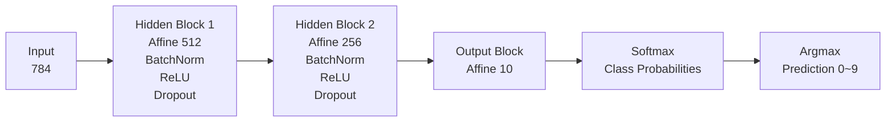
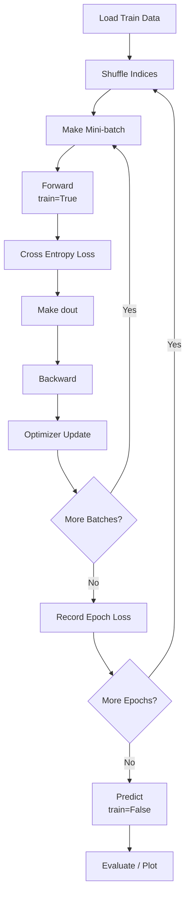

# MNIST 손글씨 숫자 인식 발표 정리

## 1. 개요

본 프로젝트는 `NumPy`만으로 신경망을 직접 구현해 MNIST 손글씨 숫자를 분류하는 과제입니다.

- **목표 정확도**: 테스트 정확도 `97% 이상`
- **최소 기준**: 테스트 정확도 `95% 이상`
- **구현 핵심**: `forward -> loss -> backward -> optimizer update`
- **참고 범위**: 『밑바닥부터 시작하는 딥러닝』 1~6장

---

## 2. 데이터셋

| 항목 | shape | 설명 |
| --- | --- | --- |
| `x_train` | `(60000, 784)` | 학습 이미지 |
| `y_train` | `(60000,)` | 학습 라벨 |
| `x_test` | `(10000, 784)` | 테스트 이미지 |
| `y_test` | `(10000,)` | 테스트 라벨 |

- 원본 이미지는 `28x28` 픽셀
- 입력은 `784`차원 벡터로 펼쳐 사용
- 픽셀 값은 `0~1` 범위로 정규화

---

## 3. 구현 범위

| 구분 | 파일 | 구현 내용 |
| --- | --- | --- |
| 데이터 | `src/data.py` | MNIST 다운로드 및 로드 |
| 활성화 함수 | `src/activations.py` | `ReLU`, `Softmax` |
| 기본 레이어 | `src/layers.py` | `Affine`, `BatchNorm`, `Dropout` |
| 손실 함수 | `src/losses.py` | `cross_entropy_loss` |
| 옵티마이저 | `src/optimizers.py` | `SGD`, `Adam` |
| 모델 | `src/network.py` | `NeuralNetwork` |
| 학습/평가 | `src/training.py` | `train`, `evaluate`, `plot_loss_history` |

---

## 4. 모델 구조

### 4.1 기본 구조

```text
입력 784
-> Affine(512)
-> BatchNorm
-> ReLU
-> Dropout
-> Affine(256)
-> BatchNorm
-> ReLU
-> Dropout
-> Affine(10)
-> Softmax
```

### 4.2 구조도



### 4.3 블록별 구성

| 블록 | 구성 | 역할 |
| --- | --- | --- |
| Input | `784` | 28x28 이미지를 펼친 입력 |
| Hidden Block 1 | `Affine(512) -> BatchNorm -> ReLU -> Dropout` | 1차 feature 추출 |
| Hidden Block 2 | `Affine(256) -> BatchNorm -> ReLU -> Dropout` | 2차 feature 추출 |
| Output Block | `Affine(10) -> Softmax -> Argmax` | 클래스 점수, 확률, 최종 예측 생성 |

---

## 5. 학습 흐름

각 미니배치마다 다음 순서로 학습을 수행합니다.

1. `Forward`: `model.forward(x_batch, train=True)`
2. `Loss`: `cross_entropy_loss(y_pred, y_batch)`
3. `Backward`: 출력층 gradient 계산 후 `model.backward(dout)`
4. `Update`: `optimizer.update(model.params, model.grads)`

### 5.1 학습 루프 플로우차트



### 5.2 Softmax + Cross Entropy

```python
dout = y_pred.copy()
dout[np.arange(batch_size), y_batch] -= 1
dout /= batch_size
```

- 출력층에서는 `Softmax`와 `Cross Entropy`를 함께 사용
- 학습 루프에서 최종 gradient를 직접 생성

---

## 6. 테스트 결과

전체 테스트 실행 결과:

```bash
pytest tests/ -q
```

결과:

- `21 passed`
- warning 1개
- 총 실행 시간: 약 `0.90s`

---

## 7. 메인 실험 결과

`mnist_lab.ipynb` 최종 학습 셀 기준:

```python
model = NeuralNetwork(use_batchnorm=True, use_dropout=True)
optimizer = Adam(lr=0.026677926407289915)
loss_history = train(model, optimizer, x_train, y_train, epochs=64, batch_size=100)
```

최종 출력:

| 항목 | 값 |
| --- | --- |
| Train Accuracy | `99.87%` |
| Test Accuracy | `98.60%` |
| Total Params | `537,354` |

요약:

- 과제 최소 기준 `95%`를 넘었고
- 목표 정확도 `97%`도 달성함

---

## 8. 저장된 모델 비교

`saved_models` 폴더 기준으로 확인한 주요 실험 결과입니다.

| 파일 | BN | Dropout | Dropout Ratio | Epochs | Batch | LR | Final Train Acc | Final Test Acc | Final Loss | Params |
| --- | --- | --- | --- | ---: | ---: | ---: | ---: | ---: | ---: | ---: |
| `20ep-adam-mj.pkl` | X | X | - | 20 | 128 | 0.02668 | 99.48% | 96.01% | 0.0881 | 535,818 |
| `20ep-adam-bn-dr00-mj.pkl` | O | X | - | 20 | 128 | 0.02668 | 99.47% | 95.89% | 0.0897 | 535,818 |
| `20ep-adam-bn-dr02-yk.pkl` | O | O | 0.2 | 20 | 128 | 0.02668 | 99.40% | 98.23% | 0.0852 | 537,354 |
| `20ep-adam-bn-dr03-yk.pkl` | O | O | 0.3 | 20 | 128 | 0.02668 | 99.41% | 98.07% | 0.0876 | 537,354 |
| `64ep-yk.pkl` | 메타 없음 | 메타 없음 | 메타 없음 | 64 | - | - | 99.89% | 97.49% | 0.0312 | 535,818 |

### 8.1 비교 해석

- `BatchNorm + Dropout(0.2)` 조합이 20 epoch 기준 가장 높은 정확도인 `98.23%`를 기록
- `Dropout 0.3`도 `98.07%`로 비슷한 수준
- `BatchNorm/Dropout` 없이도 `96.01%`로 최소 기준은 통과
- 노트북 최종 실험(`64 epoch`)은 `98.60%`로 가장 높은 결과 확인

---

## 9. 손실 곡선 요약

저장된 체크포인트 기준 손실 변화:

| 파일 | 첫 epoch loss | 마지막 epoch loss | epoch 수 |
| --- | ---: | ---: | ---: |
| `20ep-adam-mj.pkl` | 3.1758 | 0.0881 | 20 |
| `20ep-adam-bn-dr00-mj.pkl` | 3.4015 | 0.0897 | 20 |
| `20ep-adam-bn-dr02-yk.pkl` | 0.3108 | 0.0852 | 20 |
| `20ep-adam-bn-dr03-yk.pkl` | 0.3122 | 0.0876 | 20 |
| `64ep-yk.pkl` | 2.9988 | 0.0312 | 64 |
| `1500ep-mj.pkl` | 0.3199 | 0.0563 | 64 |

관찰 포인트:

- 전체적으로 epoch가 진행될수록 loss가 감소
- `Dropout 0.2 / 0.3` 실험은 초반 loss부터 비교적 안정적인 편
- `64 epoch` 학습에서는 loss가 `0.03`대까지 내려감

---

## 10. 주요 인사이트

### 10.1 성능 측면

- 최소 기준 `95%`는 여러 설정에서 달성
- `98% 이상` 결과는 `BatchNorm + Dropout` 조합에서 확인
- 최종 노트북 실험은 `98.60%`로 목표 정확도 `97%`를 넘김

### 10.2 구조 측면

- `Affine -> BatchNorm -> ReLU -> Dropout` 블록을 2회 반복하는 구조가 안정적으로 동작
- 출력층에서는 `Softmax + Cross Entropy` 결합 gradient를 사용

### 10.3 실험 측면

- learning rate, BatchNorm, Dropout 여부가 정확도에 큰 영향을 줌
- 같은 20 epoch라도 regularization 조합에 따라 `95.89% ~ 98.23%`까지 차이 발생

---

## 11. 점검 및 주의사항

이번 확인 과정에서 체크한 사항:

- 전체 테스트 통과 여부
- 노트북 최종 출력과 저장된 체크포인트 결과 비교
- 저장된 모델의 loss history, accuracy, parameter 수 확인

주의사항:

- 일부 체크포인트는 메타데이터가 실제 학습 설정과 일치하지 않음  
  예: `1500ep-mj.pkl`은 파일명과 `epoch` 값이 `1500`이지만 실제 `loss_history` 길이는 `64`
- BatchNorm 사용 모델은 `running_mean`, `running_var`를 별도 저장하지 않으면 재로딩 후 동일 성능 재현이 어려울 수 있음

따라서 발표 자료의 주요 성능 수치는:

- `mnist_lab.ipynb` 최종 출력
- `saved_models` 내부 `results` / `metrics`

를 기준으로 정리하는 것이 가장 안전함

---

## 12. 정리

- NumPy만으로 신경망 전체 학습 과정을 직접 구현함
- 전체 테스트 `21개`를 통과함
- 저장된 실험 결과와 노트북 최종 출력 기준으로 `97% 이상` 목표를 달성함
- 최종 발표에서는 아래 3가지를 핵심으로 보여주면 충분함

1. 모델 구조와 학습 흐름
2. 테스트 통과 결과
3. 실험 비교표와 최종 정확도 `98.60%`
