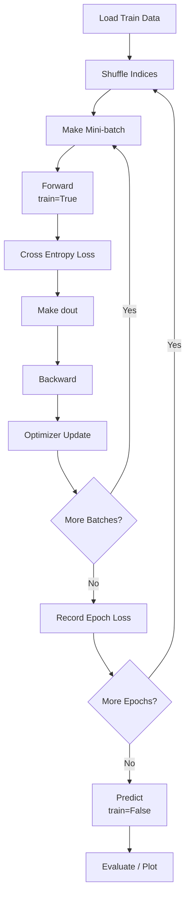
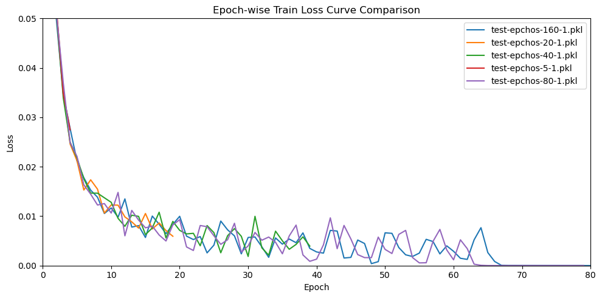

# MNIST 손글씨 인식 과제 보고서

## 0. 반·팀원

| 항목     | 내용            |
| ------ | ------------- |
| **반**  | 3반, 7조    |
| **팀원** | 유승이, 이민정, 이우진 , 홍윤기 |

---

## 1. 실험 목적

본 프로젝트는 `NumPy`만으로 신경망을 직접 구현해 MNIST 손글씨 숫자를 분류하는 과제입니다.

- **목표 정확도**: 테스트 정확도 `97% 이상`
- **최소 기준**: 테스트 정확도 `95% 이상`
- **구현 핵심**: `forward -> loss -> backward -> optimizer update`
- **참고 범위**: 『밑바닥부터 시작하는 딥러닝』 1~6장

---

## 2. 모델 구조

| 블록 | 구성 | 역할 |
| --- | --- | --- |
| Input | `784` | 28x28 이미지를 펼친 입력 |
| Hidden Block 1 | `Affine(512) -> BatchNorm -> ReLU -> Dropout` | 1차 feature 추출 |
| Hidden Block 2 | `Affine(256) -> BatchNorm -> ReLU -> Dropout` | 2차 feature 추출 |
| Output Block | `Affine(10) -> Softmax -> Argmax` | 클래스 점수, 확률, 최종 예측 생성 |

**(2층 은닉):**  
입력 784 → Affine(512) → BatchNorm → ReLU → Dropout → Affine(256) → BatchNorm → ReLU → Dropout → Affine(10) → Softmax

---

## 3. 학습 설정

### 기본 Hyperparameter
| 항목                 | 값           |
| ------------------ | ----------- |
| 옵티마이저              | Adam        |
| 학습률 (lr)           | 0.001       |
| epochs             | 20          |
| batch_size         | 128         |
| Dropout 비율         | 0           |
| BatchNorm           | None        |
| 가중치 초기화            | He        |

---

## 4. 실험 환경

- Python 3.11, NumPy, Matplotlib
- 학습 소요 시간: (예: CPU 기준 약 2~3분)

---

## 5. 결과

| 항목           | 값              |
| ------------ | -------------- |
| **테스트 정확도**  | 98.68%    |
| **총 파라미터 수** | 537,354 |

## 6. 테스트별 결과

| 파일 | BN | Dropout | Dropout Ratio | Epochs | Batch | LR | Final Train Acc | Final Test Acc | Final Loss | Params | Time |
| --- | --- | --- | --- | ---: | ---: | ---: | ---: | ---: | ---: | ---: | ---: |
| `test-lr-10-1.pkl` | O | X | - | 20 | 128 | 0.001 | 99.88% | 98.28% | 0.0064 | 537,354 | 126.27s |
| `test-lr-10-2.pkl` | O | X | - | 20 | 128 | 0.001 | 99.90% | 98.30% | 0.0049 | 537,354 | 119.78s |
| `test-lr-10-3.pkl` | O | X | - | 20 | 128 | 0.001 | 99.92% | 98.36% | 0.0065 | 537,354 | 112.20s |
| `test-lr-05-1.pkl` | O | X | - | 20 | 128 | 0.0005 | 99.94% | 98.30% | 0.0030 | 537,354 | 112.24s |
| `test-lr-05-2.pkl` | O | X | - | 20 | 128 | 0.0005 | 99.97% | 98.21% | 0.0032 | 537,354 | 118.84s |
| `test-lr-05-3.pkl` | O | X | - | 20 | 128 | 0.0005 | 99.91% | 98.06% | 0.0044 | 537,354 | 103.53s |
| `test-lr-01-1.pkl` | O | X | - | 20 | 128 | 0.0001 | 100.00% | 98.04% | 0.0030 | 537,354 | 128.66s |
| `test-lr-01-2.pkl` | O | X | - | 20 | 128 | 0.0001 | 100.00% | 98.14% | 0.0030 | 537,354 | 145.92s |
| `test-lr-01-3.pkl` | O | X | - | 20 | 128 | 0.0001 | 100.00% | 98.14% | 0.0028 | 537,354 | 145.33s |
| `test-bat-f-nd-1.pkl` | X | X | - | 20 | 128 | 0.001 | 99.72% | 98.02% | 0.0066 | 535,818 | 117.58s |
| `test-bat-f-nd-2.pkl` | X | X | - | 20 | 128 | 0.001 | 99.77% | 97.95% | 0.0097 | 535,818 | 137.60s |
| `test-bat-f-nd-3.pkl` | X | X | - | 20 | 128 | 0.001 | 99.84% | 98.22% | 0.0080 | 535,818 | 168.76s |
| `test-bat-f-02-1.pkl` | X | O | 0.2 | 20 | 128 | 0.001 | 99.79% | 98.39% | 0.0411 | 535,818 | 150.17s |
| `test-bat-f-02-2.pkl` | X | O | 0.2 | 20 | 128 | 0.001 | 99.79% | 98.48% | 0.0400 | 535,818 | 157.39s |
| `test-bat-f-02-3.pkl` | X | O | 0.2 | 20 | 128 | 0.001 | 99.74% | 98.53% | 0.0379 | 535,818 | 154.57s |
| `test-bat-f-03-1.pkl` | X | O | 0.3 | 20 | 128 | 0.001 | 99.81% | 98.52% | 0.0358 | 535,818 | 172.62s |
| `test-bat-f-03-2.pkl` | X | O | 0.3 | 20 | 128 | 0.001 | 99.74% | 98.54% | 0.0366 | 535,818 | 153.08s |
| `test-bat-f-03-3.pkl` | X | O | 0.3 | 20 | 128 | 0.001 | 99.78% | 98.40% | 0.0392 | 535,818 | 156.62s |
| `test-bat-t-nd-1.pkl` | O | X | - | 20 | 128 | 0.001 | 99.89% | 98.30% | 0.0059 | 537,354 | 185.00s |
| `test-bat-t-nd-2.pkl` | O | X | - | 20 | 128 | 0.001 | 99.96% | 98.51% | 0.0032 | 537,354 | 210.87s |
| `test-bat-t-nd-3.pkl` | O | X | - | 20 | 128 | 0.001 | 99.93% | 98.36% | 0.0070 | 537,354 | 196.99s |
| `test-bat-t-02-1.pkl` | O | O | 0.2 | 20 | 128 | 0.001 | 99.83% | 98.43% | 0.0426 | 537,354 | 177.62s |
| `test-bat-t-02-2.pkl` | O | O | 0.2 | 20 | 128 | 0.001 | 99.78% | 98.49% | 0.0432 | 537,354 | 167.49s |
| `test-bat-t-02-3.pkl` | O | O | 0.2 | 20 | 128 | 0.001 | 99.80% | 98.44% | 0.0440 | 537,354 | 163.08s |
| `test-bat-t-03-1.pkl` | O | O | 0.3 | 20 | 128 | 0.001 | 99.83% | 98.37% | 0.0428 | 537,354 | 165.27s |
| `test-bat-t-03-2.pkl` | O | O | 0.3 | 20 | 128 | 0.001 | 99.81% | 98.36% | 0.0421 | 537,354 | 167.61s |
| `test-bat-t-03-3.pkl` | O | O | 0.3 | 20 | 128 | 0.001 | 99.79% | 98.41% | 0.0452 | 537,354 | 164.67s |
| `test-epchos-5-1.pkl` | X | X | - | 5 | 128 | 0.001 | 99.41% | 97.87% | 0.0275 | 535,818 | 42.32s |
| `test-epchos-5-2.pkl` | X | X | - | 5 | 128 | 0.001 | 99.31% | 97.99% | 0.0258 | 535,818 | 36.16s |
| `test-epchos-5-3.pkl` | X | X | - | 5 | 128 | 0.001 | 99.50% | 97.79% | 0.0244 | 535,818 | 36.37s |
| `test-epchos-20-1.pkl` | X | X | - | 20 | 128 | 0.001 | 99.90% | 98.28% | 0.0059 | 535,818 | 148.48s |
| `test-epchos-20-2.pkl` | X | X | - | 20 | 128 | 0.001 | 99.80% | 98.26% | 0.0107 | 535,818 | 151.09s |
| `test-epchos-20-3.pkl` | X | X | - | 20 | 128 | 0.001 | 99.91% | 98.28% | 0.0052 | 535,818 | 149.37s |
| `test-epchos-40-1.pkl` | X | X | - | 40 | 128 | 0.001 | 99.94% | 98.42% | 0.0039 | 535,818 | 287.88s |
| `test-epchos-40-2.pkl` | X | X | - | 40 | 128 | 0.001 | 99.84% | 98.16% | 0.0039 | 535,818 | 299.19s |
| `test-epchos-40-3.pkl` | X | X | - | 40 | 128 | 0.001 | 99.94% | 98.39% | 0.0037 | 535,818 | 280.00s |
| `test-epchos-80-1.pkl` | X | X | - | 80 | 128 | 0.001 | 100.00% | 98.68% | 0.0000 | 535,818 | 570.92s |
| `test-epchos-80-2.pkl` | X | X | - | 80 | 128 | 0.001 | 100.00% | 98.68% | 0.0000 | 535,818 | 633.78s |
| `test-epchos-80-3.pkl` | X | X | - | 80 | 128 | 0.001 | 100.00% | 98.57% | 0.0000 | 535,818 | 527.62s |
| `test-epchos-160-1.pkl` | X | X | - | 160 | 128 | 0.001 | 100.00% | 98.64% | 0.0000 | 535,818 | 1017.49s |
| `test-epchos-160-2.pkl` | X | X | - | 160 | 128 | 0.001 | 100.00% | 98.66% | 0.0000 | 535,818 | 979.74s |
| `test-epchos-160-3.pkl` | X | X | - | 160 | 128 | 0.001 | 100.00% | 98.60% | 0.0000 | 535,818 | 996.83s |

**총 학습 시간**: 10,236.97초 (약 170.62분, 2.84시간)

### 손실 커브

- 학습 곡선: (그래프 이미지를 붙이거나, 예: "Epoch 1 Loss 0.42 → Epoch 20 Loss 0.06 수렴" 같이 수치로 요약)

---

## 6. 회고

- 손실 수렴 여부, 과적합/과소적합 여부
- 구조·학습률·Dropout 등 변경 시도와 그 결과 (있다면 간단히)
